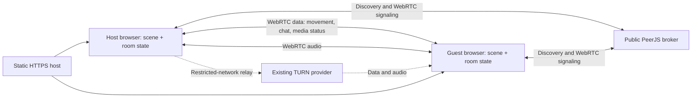

# Current architecture and gap analysis

Audited 28 September 2026 against commit `a594065` and the working tree. This document records the pre-change inspection gate; its line references describe that baseline. The user subsequently requested continuation into Stage 1. See [Stage 1 status](STAGE1_STATUS.md) for later edits. Existing modified/untracked screenshots have been preserved.

## Summary

**Keep Three.js, the procedural Kerala scenery, camera-relative movement, and the working two-person connection flow.** The application is a functional private exploration prototype, not yet a public world. Its primary constraints are a singleton remote player, browser-owned rooms, one fully resident scene, and no backend in this repository.

The network-enabled Chrome regression passed creation/join, movement, chat, audio RTP in both directions, mute, full-room rejection, replacement guests, microphone-denied fallback, listen-only audio, and missing-room handling. This does not establish cross-browser, physical mobile, or different-network reliability. See [verification evidence](docs/audit-2026-09-28/VERIFICATION.md).

Companion documents:

- [Target architecture](docs/TARGET_ARCHITECTURE.md): system boundaries, streaming, multiplayer, voice, assets, mobile, deployment and costs.
- [District roadmap](docs/DISTRICT_ROADMAP.md): all 14 regions, geographical structure, hubs, landmarks and routes.
- [Migration plan](docs/MIGRATION_PLAN.md): ordered phases, exit criteria, risks and complexity.

## A. Existing implementation

| Area | What actually exists | Evidence |
| --- | --- | --- |
| Framework | Vanilla HTML, CSS and JavaScript, one strict-mode IIFE. No React, bundler, package manifest or application build step. | `index.html:18,120`; repository inventory |
| Renderer | Pinned Three.js 0.160.1 global CDN build; WebGLRenderer; perspective camera; ACES tone mapping. | `index.html:118,263` |
| Scene | `buildWorld()` eagerly constructs one scene. Three labels cover backwaters, Munnar-inspired hills and Kochi-inspired coast. They are coordinate predicates, not loadable regions. | `index.html:151,263,325` |
| Geography | A roughly elliptical island with radii 64 × 43 world units; analytical hills in the northwest, coast northeast, jetty south. It is not a state map. | `index.html:189,191,271` |
| Assets / model format | Procedural Three.js primitives and BufferGeometry; no GLB/glTF models or asset files. Cached materials and primitive geometry; one instanced tea-bush mesh. | `index.html:169,173,213,226,237,246,289` |
| Textures | Mostly flat colors and vertex colors. Runtime CanvasTextures for signs and nametags; no image-texture pipeline or compression. Old nametag texture/material disposed on replacement. | `index.html:196,257,316` |
| Animation | Procedural feet swing, body bob, palms, boats and fireflies. No skeleton, animation clips, emote state machine or interactions. Reduced-motion support is partial: foot swing remains. | `index.html:339,348` |
| Camera | Smoothed third-person orbit, drag yaw/pitch, scroll distance 7–29. Terrain floor protects camera height; no building occlusion/collision solution. Fixed overview on landing. | `index.html:351,353,555` |
| Input / collision | WASD/arrows, normalized diagonal movement, shift run, camera-relative direction. Island/jetty bounds and circular obstacle checks; no physics engine. O(number of obstacles) checks per movement axis. | `index.html:323,327,546` |
| Mobile | Responsive HUD, 44px touch direction buttons on coarse pointers, drag camera, chat/mic. No analog joystick, pinch zoom, interaction/emote controls or quality settings. | `index.html:77,82,112,555` |
| Networking | PeerJS 1.5.5 over WebRTC. Exactly one `state.conn`, one `remoteAvatar`, one remote transform. No authoritative application server. | `index.html:119,156,303,434` |
| Room creation / joining | Host registers `somewhere-kerala-v1-` plus random six-character code; guest gets an independent peer ID and connects to host. `hello`/`welcome` protocol admission. Extra guests rejected. Invite lives in URL fragment. | `index.html:132,359,384,402,443,544` |
| Reliability | 18s broker timeout, 45s join timeout, 30s handshake timer, session guards, code-collision retries, reconnect UI. Host survives guest departure; host departure ends the room. | `index.html:135,374,394,413,436,479,545` |
| Player sync | Reliable JSON data channel. Position `(x,z)`, yaw and sequence at 12 Hz, even idle. 32 KiB send-buffer guard; finite values, coordinate range and increasing sequence checks. Exponential position/yaw interpolation; movement animation inferred locally. | `index.html:350,370,447,486` |
| Heartbeats | Ping every four seconds; disconnect after 45s without received data when the local page is visible. Timers are outside rendering but still subject to browser background suspension. | `index.html:441,485,553` |
| Chat | Peer data channel; 400-character messages, 80 DOM rows, text-node rendering. No persistence, moderation, receive rate limit, history fetch or server authority. | `index.html:366,448,541` |
| Voice | `getUserMedia`, one PeerJS MediaConnection, one remote audio element. Host initiates when both have mics; a mic-enabled guest calls a listen-only host. Permission does not block joining. Autoplay recovery button and manual retry. | `index.html:114,391,408,492,515,520` |
| Signaling / relay | Public `0.peerjs.com:443` signaling. Google, Cloudflare and Metered STUN; existing Metered TURN options include UDP, TCP and TLS. Credentials are client-visible in static source; management credentials are not needed by the app. | `index.html:137` (credential values intentionally omitted here) |
| Proximity voice | Absent. Remote audio is not attenuated, spatialized or disconnected by distance. | `index.html:520` |
| Persistence | All room/player/chat state is in browser memory. No localStorage, IndexedDB, database, saved friends or visited places. URL fragment contains only invite code. | `index.html:156,374,563` |
| Environment | Static daylight, fog, sky and water color; low-cost ambient movement. No day cycle, rain, mist system, seasonal events or audio ambience. | `index.html:264,269,298,354` |
| Deployment | Static file serving; README names a `workers.dev` URL. No Worker source, Wrangler configuration, Pages Functions, Durable Object bindings/migrations, CI or environment files in the checkout. The remote deployment method and settings cannot be established from the URL. | repository inventory; `README.md` |
| Configuration | App settings, endpoint and ICE credentials inline. No application environment variables. Test-only variables: `TEST_URL`, `RELAY_ONLY`; exploration URL is hard-coded. | `index.html:129`; test scripts |
| Tests | Three Playwright scripts using absolute Windows runtime and Chrome paths. They exercise real CDN/signaling/TURN dependencies. Existing screenshots and README claims are historical evidence, not fresh verification. | `test-browser.cjs`, `test-exploration.cjs`, `test-turn.cjs` |

### Existing data flow

Cloudflare STUN does not imply a Cloudflare application backend. The app server does not receive player movement, chat or audio today.

## B. Current problems and gaps

### Concrete issues found by code inspection

| Priority | Finding and consequence | First fix / verification |
| --- | --- | --- |
| High | `toggleMic()` retries a missing call before toggling tracks (`index.html:531`). When data is connected but voice has failed, clicking “Mute mic” can initiate another call without muting the live local track. | Separate mute state from retry; regression with connected data + failed call. |
| High before public launch | Movement only checks a rectangle and sequence, allowing a custom peer to teleport, cross obstacles and flood valid messages (`447–451`). Chat output is escaped, but admission and actions have no public-world authority or rate limits. | Validate membership, payload/rate budgets and actions in public-room coordinator; retain simple local collision. |
| Medium | Reliable movement messages are sent every 83ms while idle (`486`). Buffer guard skips new sends but cannot remove old queued reliable messages; latency can make remote movement stale. | Change detection, latest-state coalescing, idle updates, sequence/timestamp instrumentation. |
| Medium | Rendering and environment updates continue at full rate on landing; shadow-casting objects are numerous (`178,269,348`). No adaptive quality or visibility policy. | Profile low-end devices; quality tiers, cheaper shadows and explicit pause policy. |
| Medium | `peer.on('close')` updates labels without immediately clearing `state.connected`, the avatar or call (`426`). Transport events/heartbeat may eventually clean this up. | Add peer destruction / transport-loss lifecycle tests and converge cleanup paths. |
| Medium | RTC diagnostics remain “connected” after normal guest departure; `dropConnection()` does not reset RTC fields. Observed in baseline output. | Report active transport vs last-known diagnostic state separately. |
| Medium | Pending connection occupies the sole guest slot until its 30s handshake timer expires (`404,436`). Fine for friends; unsuitable admission control for strangers. | Bounded admission reservations and per-source retry limits. |
| Medium | TURN credentials ship in HTML; no short-lived credential endpoint, usage telemetry or documented quota. | Establish existing provider entitlement/rotation; keep secrets for credential issuance server-side if supported. |

These findings do not mean the successful ordinary connection flow is broken. Failure-path fixes should be isolated and tested before expanding it.

### Product/system gap matrix

| Requirement | Current position | Required addition |
| --- | --- | --- |
| Whole Kerala / 14 districts | Three labels on one small island | Geographical catalog, district manifests, routes and streamed chunks |
| 10–20 users / public spaces | Two peers, host-dependent room | Player registry, public directory, capped authoritative room service |
| Who is around | One friend indicator | Occupancy, nearby people, join/leave updates |
| Travel | Walking only; boats decorative | World-space routes, bus/rail/jetty travel transaction and loading recovery |
| Social interaction | Walking/chat/voice only | Reusable actions, seats, partner consent, temporary follow |
| In-world activity | None | ActivityManager plus one tea-shop trivia table |
| Proximity voice | One full-volume stream | Per-peer calls, distance gain, bounded neighbor graph and lifecycle |
| Mobile | Direction pad and fixed panels | Joystick, compact contextual controls, real device QA and quality tiers |
| Atmosphere/events | Static afternoon | Shared environment clock, local effects and reversible event hooks |
| Memory / GPU | Entire scene resident | Chunk ownership, disposal, shared asset references, budgets and soak tests |
| Memories / return loop | No persistence | Optional local visited-place postcards after core loop; no account system required initially |

## Existing performance characteristics

- `index.html` is 60,767 bytes on disk. No external model download exists; CDN library downloads still affect cold start.
- Ground and sand each use a 26-ring, 112-segment mesh. Many houses/palm parts are separate meshes even when geometry/materials are cached. Reuse saves allocations, not necessarily draw calls.
- Pixel ratio is capped at 1.6, antialiasing enabled, one 2048² soft shadow map, far plane 350. No LOD, chunk unloading, compressed textures or GPU timing instrumentation.
- Local collision scans all obstacles. Camera creates a new Vector3 each frame. These are secondary to measuring rendering cost before scaling content.
- Existing diagnostics reported 88 and 409 render calls and 18,164–21,996 triangles at early join snapshots. These are transient, different-camera samples, not stable benchmarks or total shadow-pass cost. See verification notes for limitations.
- No sustained FPS, total GPU memory, battery, long-session memory or physical mobile performance claim is currently justified.

## Preserve during migration

Retain the visual palette and useful procedural builders; deterministic terrain/prop placement; camera-relative controls; name/chat text escaping; protocol/session guards; position interpolation; listen-only audio; autoplay recovery; and existing connection tests. Keep the current private experience runnable while introducing module boundaries. A new framework, physics engine, SFU or database is not necessary for the first phases.
