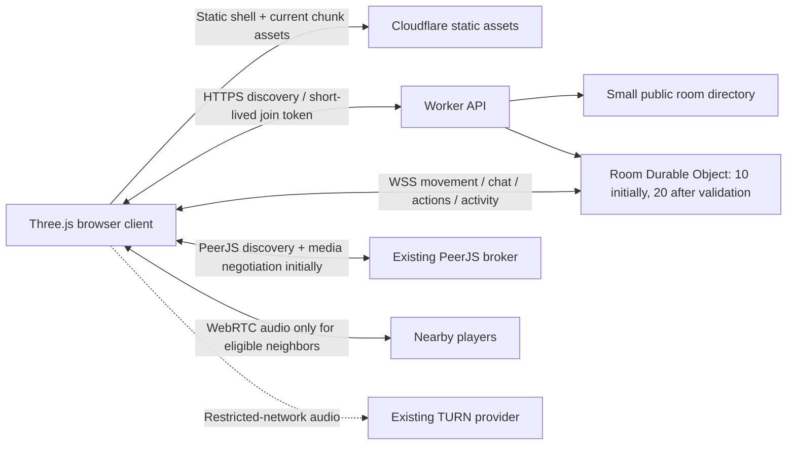

# Target architecture

**Proposal, not implemented or deployed.** Read [the current audit](../CURRENT_ARCHITECTURE.md) first. Keep the world as the primary screen: arrive, see people, walk/travel, talk, gather around a table, and leave with a reason to return.

## C. System boundaries

Keep vanilla JavaScript and Three.js initially. Extract ES modules incrementally; introduce package tooling only to make dependencies/tests/deploys reproducible. Do not simultaneously upgrade Three.js and redesign the world.

| Module | Responsibility |
| --- | --- |
| AppSession / UI | Join/leave state, compact HUD, nearby people, travel panels, accessibility and errors |
| WorldCatalog | Small metadata for all districts, world coordinates, route graph, landmark IDs and versions |
| WorldStreamer / AssetStore | Async chunk lifecycle, cancellation, budgets, reference-counted shared resources |
| WorldRenderer / EnvironmentSystem | Existing renderer/camera, quality levels, lighting and local effects |
| PlayerRegistry / PlayerController | Map of player IDs to avatars, local input/collision and remote interpolation |
| RoomTransport | Common events for join, snapshots, chat, action, leave; legacy PeerJS adapter first |
| VoiceManager | Existing mic/permission behavior, then a map of peer calls and audio gains |
| InteractionRegistry | Data-defined emotes, object actions and two-person requests |
| ActivityManager | Tables, seats, invitations, lifecycle and activity-specific state reducer |
| EventRegistry | Reversible decorations/ambience attached to district or venue IDs |

### Proposed deployment/data flow



The public room service is an intentional addition: it removes browser-host lifetime dependence and coordinates membership/activity rules. The legacy private-room adapter stays available until the new private mode meets regression gates. This diagram does not describe the current deployment.

## D. World and region architecture

Use one continuous world coordinate system: positive X east/inland, negative X toward the Arabian Sea, negative Z north. Compress distances while preserving relative north/south and coastal/hill positions. District polygons/anchors can be approximate; district names do not imply exact administrative boundaries.

North, Central and South are catalog groups, not three massive meshes. A district contains a hub chunk, travel corridor chunks, landscape chunks and selected landmark chunks. Only metadata for all 14 districts loads at startup. See [district roadmap](DISTRICT_ROADMAP.md).

Suggested manifest contract:

```text
DistrictManifest
  id, name, regionGroup, worldBounds, hub
  terrainProfile, palette, atmospherePreset
  chunkDescriptors[] { id, bounds, moduleURL, assetKeys, byteEstimate, collisionURL }
  landmarks[] { id, name, chunkId, silhouette, socialPurpose }
  socialLocations[] { id, kind, spawn, capacity, interactionIds }
  travelNodes[] { id, kind, worldPosition, routeIds }
  eventHooks[], contentVersion
```

Chunk builders receive their parent group, seeded RNG, height query and resource scope. They must not mutate global arrays or `scene` directly. Return render roots, collision shapes, interaction anchors and a dispose handle. A chunk-specific seed prevents asynchronous load order from changing terrain/props.

### Travel

Approach a bus stop, railway platform, jetty or road junction; open a small route panel showing destinations, connection type and occupancy; confirm travel. Keep the world visible. Walking across adjacent chunks remains continuous; fast travel crosses the same route graph.

Use `request → reserve destination → load minimal arrival chunk → ready → commit location → release origin`. Tag requests with transition IDs and cancel stale loads. Until commit, retain a usable origin chunk. On failure/timeout, release reservation and remain at origin. Stop follow/activity participation and reconcile voice at departure; crossfade arrival rather than simulating a train. A party transfer needs an explicit invitation and destination capacity check.

Initially one logical world instance contains at most 10, later 20, people across all districts. A room ID persists across district travel; interest filtering changes recipients without requiring distributed room handoffs. Private interiors can be separate invite-only instances; transitions then use reservations in both rooms. Never reveal private occupants through the public directory.

## E. Multiplayer architecture

### Preserve, then add a public-room adapter

1. Extract the existing two-player PeerJS flow behind RoomTransport without changing its protocol.
2. Replace the one remote avatar reference with PlayerRegistry, initially still admitting one friend.
3. Add a Worker plus one Room Durable Object per small instance for public membership, snapshots, chat and activity authority. No world simulation or physics server.
4. Test 2, 4, 10 and 20 clients. Raise the visible cap only after latency, CPU and mobile gates pass.

A lightweight directory can use one small Durable Object for room leases and occupancy. Keep directory queries on join/travel UI, not on every movement. Final admission is atomic in the destination Room object; a stale directory count must never overfill it. Create another room when full; no ranking or complex matchmaking.

### State and messages

- Each session has server-issued player ID, reconnect token, protocol/content version and current district/chunk. Display names are not identity. Private access uses an unguessable invite capability; human-friendly short codes are lookup conveniences with rate limits.
- Validate join/origin policy, membership, payload size, sequence, finite/bounded coordinates, plausible speed, action cooldowns and target proximity. Broad collision/route constraints are enough initially; do not claim cheat-proof physics.
- Predict local movement immediately. Send changed/quantized transforms at a measured 10–12 Hz ceiling; send a slower idle presence update. Drop stale queued movement at the application layer and disconnect slow consumers. Reliable ordered WebSockets cannot discard packets already sent; keep queues short.
- Room adds receive timestamps and revision numbers. Clients render remote players with a small interpolation buffer; use bounded extrapolation and correction on delayed snapshots. Discrete actions carry IDs/revisions for deduplication.
- Send movement only to players in the same/neighboring visible chunks; transmit arrivals, departures and coarse district counts separately. Nearby chat by default; clearly label instance chat if offered.
- Synchronize transform, locomotion state, emote/action, membership, seat ownership and activity state. Derive water, rain, camera movement and ambient animation locally.
- On reconnect, take a full snapshot before deltas; use a short seat grace period and a single active session per token. Version mismatches show a reload message, not partial acceptance.

### Persistence and hibernation

Keep high-rate movement ephemeral. Use WebSocket attachments for reconstructible connection metadata and a compact last-known location where appropriate; persist only room metadata and accepted activity transitions/checkpoints. Chat can remain ephemeral. Store a small local visited-place record only if the memory feature is introduced.

Cloudflare's hibernation API preserves sockets but resets in-memory object state; reconstruct sessions and activity state deliberately. Avoid an always-on tick or interval solely to keep rooms awake. Hibernation saves idle cost; active movement still causes work. [Cloudflare WebSocket guidance](https://developers.cloudflare.com/durable-objects/best-practices/websockets/)

## F. Voice architecture

Retain getUserMedia, listen-only handling, session guards, autoplay recovery and single-stream capture. Fix mute/retry independently first. Voice failure must not disconnect world/chat.

For public mode, VoiceManager holds `Map<playerId, {call, gain, state}>`. Start with PeerJS media signaling, binding each PeerJS ID to an admitted room member via the room service. Choose caller by stable player-ID ordering when both have microphones; a sole mic-enabled peer calls a listener. Validate caller membership before answering. Do not broadcast an invitation into a private space.

Initial tunable distances: clear at 0–6 world units, smooth falloff to silence by 20; add hysteresis to subscribe below 18 and disconnect above 24 after a short grace period. Subscribe only in the same acoustic space. Distance decisions use authoritative room positions; gain can update locally each frame. Close calls on room exit, mute/block relationship or expiry, and restore naturally on return. Use Web Audio GainNode so mobile browsers do not depend on HTML audio volume behavior; resume AudioContext from a user gesture.

**Full mesh is not the 20-player target.** Ten fully connected peers create 45 pairs; twenty create 190, with 19 remote peers per client. Start with a symmetric nearest-neighbor graph capped at four simultaneous voice peers per user, ranked with hysteresis. The room coordinator assigns pairs consistently so both endpoints agree. Show a clear crowded-conversation limit and offer smaller seating groups. Test four, then six, only if devices/bandwidth permit. This means a 20-person gathering cannot initially hear all 19 speakers; disclose that product tradeoff.

Proximity is a social feature, not a confidentiality guarantee between untrusted clients. For private conversations use separate room authorization and tear down public calls. No recording. Reuse the existing TURN service after checking entitlement; relay traffic still incurs provider usage. Add short-lived credentials only where supported. PeerJS documents direct data/media connections and the need for TURN where direct paths fail. [PeerJS guide](https://peerjs.com/client/getting-started)

Reconsider an SFU only after measured call-count, CPU, upload or crowd-conversation requirements exceed the bounded mesh. Document the measurements, cheaper cap/group alternatives and recurring cost before requesting paid infrastructure approval.

## G. Assets and visual identity

Keep existing procedural palms, houses, boats, paths and fishing nets as reusable builders. Improve recognizable silhouettes and terrain composition first. Alappuzha needs narrow water routes/fields, Idukki needs steep tea slopes, and Fort Kochi needs street scale plus nets; a named object alone is insufficient.

Add GLB/glTF only for authored landmarks that materially improve recognition. If textures become necessary, prefer small shared atlases and an evaluated KTX2/Basis pipeline; test loader/decoder compatibility against the retained Three.js version. Choose geometry compression only after measuring decoder cost vs download savings. Do not add decoders for assets that do not exist yet.

Use shared geometry/material references, instanced repeated vegetation, terrain LOD, simplified collision and distance-based shadow casting. Give assets stable versioned keys and ownership counts. Chunk removal releases its references; dispose GPU resources only when the last owner releases them. Bound caches and pooled avatars/effects. Review Kerala-specific buildings, signs and cultural spaces for accuracy; keep religious/heritage settings respectful and distinguish inspired scenes from literal reconstructions.

## H. Streaming strategy

Chunk state: `unloaded → loading → ready → active → cooling → unloaded`, with failure/cancel transitions. Load current chunk first, then neighbors required by view/movement; prefetch one likely travel destination only within budget. Prioritize collision and arrival ground before decoration. Use a low-detail horizon/sea/Ghats silhouette without loading remote districts.

Start with ~96–128-unit chunks and a conservative mobile residency cap (current plus up to two neighbors); measure before fixing dimensions. A neighborhood crossing temporarily permits overlap within the memory cap. If a load is incomplete, stop at an explained boundary or keep the origin available. Never leave an avatar standing on unloaded ground.

Unloading removes render roots, colliders, interaction anchors, animation registrations, event listeners, texture references and pending tasks. Refuse stale async completions using generation IDs. Test repeated back-and-forth travel, failed downloads, concurrent travel attempts and WebGL context loss. GPU disposal, not just hiding objects, is the completion criterion.

## I. Mobile and performance strategy

- Floating left joystick; right camera drag and contextual action. Compact buttons for emotes, chat, mic and settings; collapsible conversation. Respect safe areas, landscape and software keyboard. Use at least 44px touch targets.
- Start a measured low tier with DPR 1, reduced shadows/foliage, smaller textures and no expensive postprocessing. Higher tiers opt into better shadows and more detail; quality choice survives locally.
- Preserve keyboard controls and visible focus. Make invite, mute, travel and activity flows screen-reader usable. Offer reduced motion, clear mic status and retry independent of mute.
- Pause local visual effects when hidden; reconcile authoritative state on foreground return. Test mobile OS suspension rather than assuming timers keep running.
- Tentative release budgets: mobile p95 frame time ≤33ms, desktop ≤20ms; arrival chunk useful within 5s on the agreed mobile network profile; input-to-local movement within a frame; remote movement delay tracked against RTT; memory/resource counts plateau across 30 travel cycles. These are targets, not current results.
- Record device, GPU, browser, quality, viewport, network and participant count. Measure JS heap and GPU resource counts separately; neither is total browser/GPU memory. Avoid declaring victory from desktop viewport emulation.

## Activities, interactions and events

Interaction definitions contain `id`, label, icon, animation, duration, cooldown, range and targeting policy. Initial registry: wave, sit, dance, laugh, greet, high-five, point, temporary follow. Seats reserve a stable anchor. High-five needs a nearby partner's acceptance; follow is visibly time-limited and stops on travel/leave/blocked access.

**First activity: a short Kerala discovery trivia round at a tea-shop table.** It supports 2–4 seated players and spectators; it is cheaper to validate than networked carrom physics and fits short social visits. Approach table → see seated people → join/invite → ready → five questions → shared result → stay at table. Keep the world rendered and voice available. Use a modest board panel, not a launcher.

Activity lifecycle: `idle → seating → ready → playing → results → idle`. The room owns seats, round seed, deadlines, accepted answers, scoring and version. Send current question/options but withhold correct answers until reveal; prevent duplicate/late submissions. Handle disconnect grace, all players leaving, timeout, spectators and snapshot recovery. Store progress after accepted discrete transitions. Other adapters (Ludo, Carrom, Chess) register later; do not implement them now.

EnvironmentSystem derives time-of-day from room epoch + local clock offset; send seed/phase changes only. Morning/afternoon/sunset/night adjust sky, fog and existing lighting. Rain uses a small camera-local particle pool; mist uses fog and visibility. Weather audio starts only after user interaction and has independent volume.

EventRegistry binds schedules/configuration to district/venue IDs, with reversible decoration/ambience hooks and asset budgets. Onam, Vishu, Pooram-inspired events, boat races, monsoon, Christmas and Eid-market atmosphere remain independently authored content. Events must clean up on expiry/unload; no branching throughout core world code.

## J. Cloudflare deployment and cost boundaries

First recover/document the actual current Cloudflare deployment settings. The checkout only proves static hosting compatibility. Keep that hosting while adding reproducible configuration. Workers Static Assets is a suitable candidate for static files plus API routing; if the existing deployment is Pages, retain it and route the API to a Worker. [Cloudflare Static Assets](https://developers.cloudflare.com/workers/static-assets/)

Proposed checked-in configuration: static asset directory, Worker entry, pinned compatibility date, room/directory Durable Object bindings and SQLite-class migrations, separate preview/production environments and rollback instructions. Keep account credentials and TURN management secrets in platform secrets. Public config exposes only API origin, supported protocol/content version and runtime ICE configuration. Never deploy tests/screenshots/credentials intended only for tooling as public assets.

No separate database, paid media service or always-on game server is proposed. SQLite-backed Durable Objects are available on the Free plan, whose limits can stop operations when exceeded; account eligibility and existing usage still need verification. Incoming WebSocket messages use a 20:1 ratio for request billing; outgoing messages are not charged as requests. [Current Durable Object pricing](https://developers.cloudflare.com/durable-objects/platform/pricing/)

Planning example, not a bill: 20 players each sending 10 updates/s for one hour produce 720,000 inbound messages, equivalent to 36,000 message-billing requests before joins, chat and other operations. Naive all-to-all forwarding produces 3,800 deliveries/s; interest filtering reduces that work. A four-neighbor graph has at most 40 voice pairs at 20 users versus 190 in full mesh. If encoded speech averages an assumed 32 kbit/s per remote peer, four outgoing copies are ~128 kbit/s/player before overhead and relay accounting. Measure actual bitrate and TURN usage.

Cost controls: stop idle movement spam, bound room/player counts, hibernate idle rooms, avoid writes for every position, cap voice peers, expire directory leases, inspect usage and keep rollback controls. Obtain user approval before enabling a paid plan/service; document need, expected traffic/cost and lower-cost alternatives. No paid infrastructure has been provisioned by this audit.
